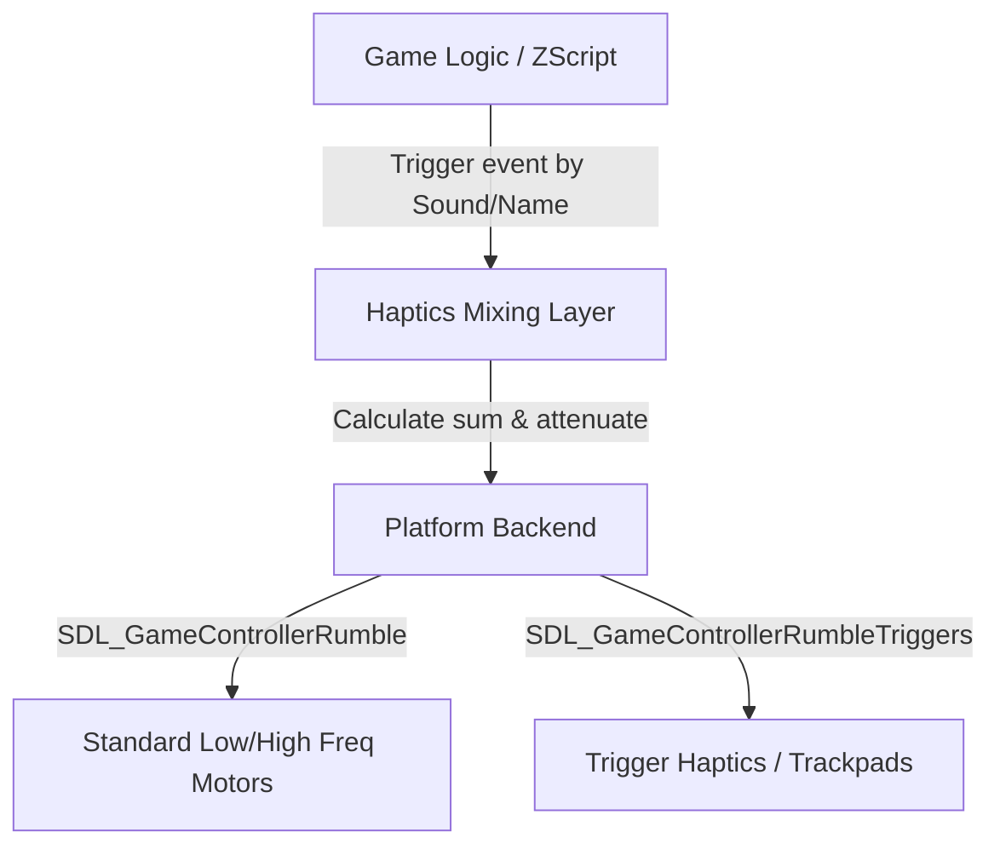

# Steam Controller & Gamepad Haptics Implementation

This document explains how the haptics (rumble and trigger haptics) system is designed in **UZDoom**, and how you can implement a similar system in other games.

---

## 1. How Haptics Work in UZDoom

UZDoom utilizes a **three-tier architecture** to handle controller haptics:



### A. The Platform Backend (SDL2 / SDL3)
On Linux and macOS, the game uses the **SDL2 GameController API** inside [i_joystick.cpp](file:///home/sofia/Documents/GitHub/uzdoom/src/common/platform/posix/sdl/i_joystick.cpp) to detect capabilities and send rumble data:

1. **Detection**:
   During controller initialization, the backend checks for rumble support using SDL functions:
   ```cpp
   Haptics = SDL_GameControllerHasRumble(Mapping) | (SDL_GameControllerHasRumbleTriggers(Mapping) << 1);
   ```

2. **Execution**:
   The engine provides a uniform API, `I_Rumble()`, which receives 4 parameters:
   - `high_freq` & `low_freq`: Standard body rumble (large motors).
   - `left_trig` & `right_trig`: Fine-grained trigger rumble (crucial for trackpads on the Steam Controller, Xbox impulse triggers, and DualSense triggers).

   ```cpp
   void SDLInputJoystick::Rumble(float high_freq, float low_freq, float left_trig, float right_trig) {
       uint16_t duration_ms = -1; // Keep rumble active until explicitly stopped or updated

       if (Haptics & HAPTICS) {
           SDL_GameControllerRumble(
               Mapping,
               static_cast<uint16_t>(0xffff * clamp(high_freq * HapticsStrength, 0.f, 1.f)),
               static_cast<uint16_t>(0xffff * clamp(low_freq * HapticsStrength, 0.f, 1.f)),
               duration_ms);
       }

       if (Haptics & HAPTICS_TRIGGERS) {
           SDL_GameControllerRumbleTriggers(
               Mapping,
               static_cast<uint16_t>(0xffff * clamp(left_trig * HapticsStrength, 0.f, 1.f)),
               static_cast<uint16_t>(0xffff * clamp(right_trig * HapticsStrength, 0.f, 1.f)),
               duration_ms);
       }
   }
   ```

### B. The Haptics Mixing Layer
Instead of directly passing raw rumble requests to the hardware (which would overwrite each other), [m_haptics.cpp](file:///home/sofia/Documents/GitHub/uzdoom/src/common/engine/m_haptics.cpp) handles state mixing:

- **Channels Map**: Active haptic effects are inserted into a channel list with a duration (represented in game tics).
- **Summation**: Every frame, `Joy_RumbleTick()` runs, cleans up stale effects, sums up the amplitudes of all active channels, and sends the mixed result to `I_Rumble()`.
- **Throttling & CVars**: Provides fine-grained settings (`haptics_strength`, `haptics_strength_lt`, etc.) to let users adjust intensities.

---

## 2. Implementing Haptics in Other Games

To implement high-fidelity haptics (like Steam Controller trackpad emulation or Xbox/DualSense trigger rumble) in your own game:

### Step 1: Use SDL3 (Recommended) or SDL2
If you are developing a new game or upgrading an existing one, use **SDL3** or **SDL2**. Both provide unified access to gamepads via the game controller database.

For SDL3:
```cpp
// Opening the gamepad
SDL_Gamepad* gamepad = SDL_OpenGamepad(instance_id);

// Check for rumble capability
bool has_rumble = SDL_GamepadHasRumble(gamepad);
bool has_trigger_rumble = SDL_GamepadHasRumbleTriggers(gamepad);
```

### Step 2: Send Haptic/Rumble Commands
To generate haptics:
```cpp
// Standard rumble
SDL_RumbleGamepad(gamepad, low_frequency_rumble, high_frequency_rumble, duration_ms);

// Trigger/Trackpad haptics (Left & Right)
SDL_RumbleGamepadTriggers(gamepad, left_trigger_rumble, right_trigger_rumble, duration_ms);
```
> [!TIP]
> **Steam Controller & Steam Input:** Steam translates `SDL_RumbleGamepadTriggers` calls to the Steam Controller's dual linear resonant actuators (trackpads) when Steam Input is active, providing high-fidelity physical clicks.

### Step 3: Implement an Event Mixer
To avoid overlapping effects canceling each other out, design a simple mixer:
```cpp
struct ActiveRumble {
    float low_freq;
    float high_freq;
    float left_trig;
    float right_trig;
    float remaining_time;
};

std::vector<ActiveRumble> active_rumbles;

void PlayRumble(float lf, float hf, float lt, float rt, float duration) {
    active_rumbles.push_back({lf, hf, lt, rt, duration});
}

void UpdateHaptics(float delta_time) {
    float mix_lf = 0.0f, mix_hf = 0.0f, mix_lt = 0.0f, mix_rt = 0.0f;

    for (auto it = active_rumbles.begin(); it != active_rumbles.end();) {
        mix_lf += it->low_freq;
        mix_hf += it->high_freq;
        mix_lt += it->left_trig;
        mix_rt += it->right_trig;

        it->remaining_time -= delta_time;
        if (it->remaining_time <= 0) {
            it = active_rumbles.erase(it);
        } else {
            ++it;
        }
    }

    // Clamp values to [0.0, 1.0] and dispatch to controller API
    DispatchToHardware(
        std::min(mix_lf, 1.0f),
        std::min(mix_hf, 1.0f),
        std::min(mix_lt, 1.0f),
        std::min(mix_rt, 1.0f)
    );
}
```

### Step 4: Map Haptics to Game Events
Define different types of rumble profiles for actions:
* **UI Navigation**: Very short, sharp high-frequency pulses on the trigger motors (`left_trig = 0.4`, `duration = 0.05s`).
* **Taking Damage**: Deep, low-frequency rumble on the main body (`low_freq = 0.8`, `duration = 0.3s`).
* **Shooting Weapons**: High-frequency body rumble mixed with a sharp kickback on the right trigger (`high_freq = 0.5`, `right_trig = 0.8`, `duration = 0.1s`).
